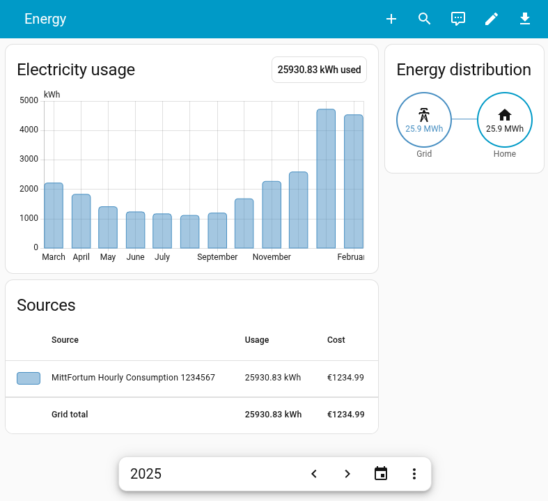
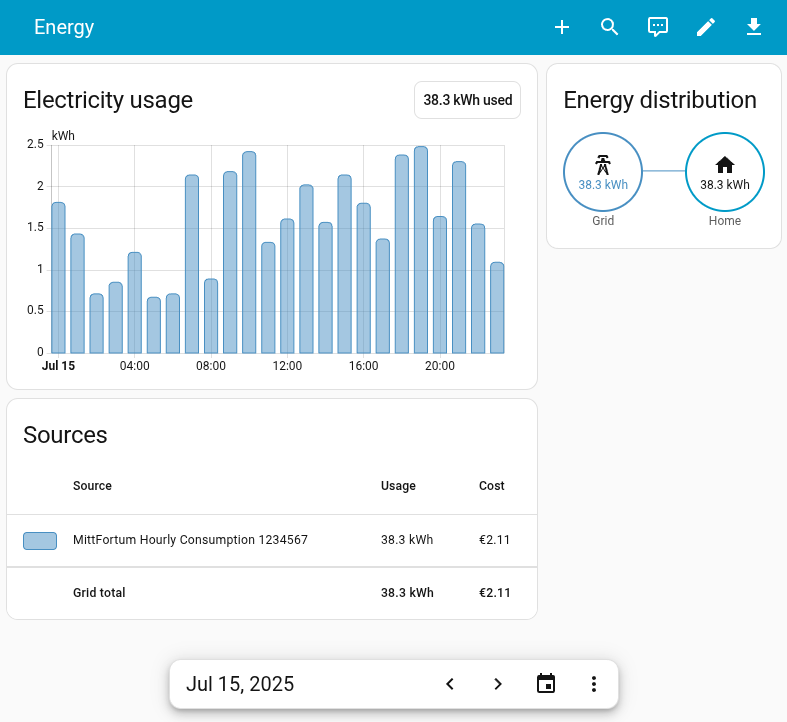

# Fortum Home Assistant Integration

A Home Assistant custom integration for accessing energy consumption data from Fortum for supported regions (currently Sweden and Finland).

## Historical Data Availability

Historical data usually available in Fortum for the past years is synced to Home Assistant:

All while keeping hourly resolution to it:

## Features

- **Hourly historical statistics**: Imports hourly consumption, cost, price, and temperature and backfills missing history on a regular interval.
- **Full available history**: Historical sync covers the entire period Fortum exposes for your metering point, which is often multiple years.
- **Energy Dashboard compatible**: Imported hourly consumption and cost are written as Home Assistant long-term statistics for Energy Dashboard and historical charts.
- **Multi-meter support**: Creates separate statistics series for each metering point found in your Fortum account.
- **Current electricity price**: Imports Fortum 15-minute spot price data and updates it in Home Assistant every 5 minutes.
- **Price forecast statistics**: Writes hourly aggregated spot-price forecast statistics (`mean`, `min`, `max`) to `fortum:price_forecast` from fetched price windows. Fortum usually provides prices for current day and tomorrow, with tomorrow typically published around 15:00 local time.

## Installation

### HACS (Recommended)

 This integration is not yet available in the default HACS repositories, but you can add it as a custom repository:

1. Open HACS in Home Assistant
2. Click on the 3 dots in the top right corner
3. Select "Custom repositories"
4. Add the repository URL: `https://github.com/akshimassar/ha-fortum`
5. Select "Integration" as the category
6. Click the "ADD" button
7. Search for "Fortum" in HACS and install it
8. Restart Home Assistant

### Manual Installation

1. Download the latest release from the [releases page](https://github.com/akshimassar/ha-fortum/releases)
2. Copy the `custom_components/fortum` directory to your Home Assistant `custom_components` directory
3. Restart Home Assistant

## Configuration

1. Go to Configuration > Integrations
2. Click "Add Integration"
3. Search for "Fortum"
4. Enter your Fortum username and password
5. Select your region and complete setup

## Initial Sync Behavior

- On first start, the integration performs a full historical sync for each discovered metering point.
- The full sync covers all hourly history available from Fortum (often years).
- Expect initial history sync to take up to **5 minutes per year** of available data.
- Integration entities become available after this initial history sync completes.

## Entities

The integration creates these regular entities:

- **Price per kWh Sensor** (`sensor`): Latest spot price, refreshed by the price coordinator every 5 minutes.
- **Tomorrow Max Price** (`sensor`): Maximum published spot price for tomorrow; unavailable until tomorrow prices are published.
- **Tomorrow Max Price Time** (`sensor`, timestamp): Timestamp for tomorrow's maximum spot price; unavailable until tomorrow prices are published.

Additionally, it imports hourly Recorder statistics for each available metering point:

These appear in Home Assistant as **"Entity without state"** entities (statistics-only entities), so they are not shown in **Developer Tools -> States** or listed under the integration's regular entity list.

- `fortum:hourly_consumption_<metering_point_no>`
- `fortum:hourly_cost_<metering_point_no>`
- `fortum:hourly_price_<metering_point_no>`
- `fortum:hourly_temperature_<metering_point_no>`
- `fortum:price_forecast` (hourly spot-price forecast aggregation)

If `Debug entities` is enabled in integration options, one debug sensor and two debug buttons are exposed:

- **Statistics Last Sync** (`sensor`, timestamp, diagnostic): Last successful statistics import time.

- **Full History Re-Sync** (`button`): Runs a forced full historical sync.
- **Clear Statistics** (`button`): Clears imported statistics series for currently discovered metering points.

## Architecture

For architecture details, project layout, and contributor-focused development notes, see `DEVELOPMENT.md`.

For minimal AI/code-agent instructions, see `AGENTS.md`.

## License

This project is licensed under the MIT License - see the LICENSE file for details.
