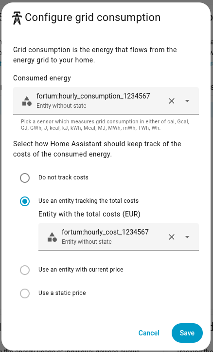
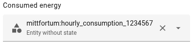

# Fortum Home Assistant Integration


A Home Assistant custom integration for accessing energy consumption data from Fortum.
Written by AI, curated by software engineer.

## Country Support

- Supported countries are currently Sweden (SE) and Finland (FI).
- If you need support for another country, please create a GitHub issue using the **Country support request** issue template.

## Dashboard

Historical data usually available in Fortum for the past years is synced to Home Assistant, all while keeping high resolution to it:

<a href="docs/images/fortum_dashboard_week.png">
  
</a>

Built-in energy dashboard is also supported:


## Features

- **Custom Fortum dashboard strategy**: Provides a dedicated Fortum dashboard that combines Energy Dashboard-style itemization with Fortum provider insights (spot price and temperature), includes a separate tomorrow-price graph, and keeps hourly-level statistics for deeper analysis.
- **Hourly historical statistics**: Imports hourly consumption, cost, price, and temperature and backfills missing history on a regular interval.
- **Full available history**: Historical sync covers the entire period Fortum exposes for your metering point, which is often multiple years.
- **Energy Dashboard compatible**: Imported hourly consumption and cost are written as Home Assistant long-term statistics for Energy Dashboard and historical charts.
- **Multi-meter support**: Creates separate statistics series for each metering point found in your Fortum account.
- **Current electricity price**: Imports Fortum 15-minute spot price data and updates it in Home Assistant every 5 minutes.
- **Price forecast statistics**: Writes hourly aggregated spot-price forecast statistics (`mean`, `min`, `max`) to `fortum:price_forecast` from fetched price windows. Fortum usually provides prices for current day and tomorrow, with tomorrow typically published around 15:00 local time.

## Installation

### HACS (Recommended)

 This integration is not yet available in the default HACS repositories, but you can add it as a custom repository:

1. Open HACS in Home Assistant
2. Click on the 3 dots in the top right corner
3. Select "Custom repositories"
4. Add the repository URL: `https://github.com/akshimassar/ha-fortum`
5. Select "Integration" as the category
6. Click the "ADD" button
7. Search for "Fortum" in HACS and install it
8. Restart Home Assistant

### Manual Installation

1. Download this repository as ZIP (Code -> Download ZIP) or clone it locally.
2. Copy the `custom_components/fortum` directory to your Home Assistant `custom_components` directory.
3. Restart Home Assistant.

## Configuration

1. Go to Configuration > Integrations
2. Click "Add Integration"
3. Search for "Fortum"
4. Enter your Fortum username and password
5. Select your region and complete setup

### Dashboard Setup

- In integration options, enable **Create Fortum dashboard** to auto-create a Fortum dashboard when missing.
- The same option can also bootstrap Energy sources when supported (currently Home Assistant `2026.1-2026.3`).
- The integration adds the Lovelace strategy resource automatically during setup.

If you fully manage Lovelace resources manually and disable/override automatic resources, ensure `/fortum-energy/fortum-energy-strategy.js` is added as a `module` resource and create the dashboard as follows:
```yaml
title: Fortum
strategy:
  type: custom:fortum-energy
```

For dashboard behavior and strategy options (including `energy_sources` overrides), see `docs/dashboard.md`.

For manual Energy setup, add Fortum hourly statistics under Grid consumption:



## Initial Sync Behavior

- On first start, the integration performs a full historical sync for each discovered metering point.
- The full sync covers all hourly history available from Fortum (often years).
- Expect initial history sync to take up to **5 minutes per year** of available data.
- Integration entities become available after this initial history sync completes.

## Entities

The integration creates these regular entities:

- **Price per kWh Sensor** (`sensor`): Latest spot price, refreshed by the price coordinator every 5 minutes.
- **Tomorrow Max Price** (`sensor`): Maximum published spot price for tomorrow; unavailable until tomorrow prices are published.
- **Tomorrow Max Price Time** (`sensor`, timestamp): Timestamp for tomorrow's maximum spot price; unavailable until tomorrow prices are published.
- Together with the dashboard tomorrow-price graph, these sensors expose tomorrow peak pricing directly for automations and planning.

Additionally, it imports hourly Recorder statistics for each available metering point:

These appear in Home Assistant as **"Entity without state"** entities (statistics-only entities), so they are not shown in **Developer Tools -> States** or listed under the integration's regular entity list.



- `fortum:hourly_consumption_<metering_point_no>`
- `fortum:hourly_cost_<metering_point_no>`
- `fortum:hourly_price_<metering_point_no>`
- `fortum:hourly_temperature_<metering_point_no>`
- `fortum:price_forecast` (hourly spot-price forecast aggregation)

If `Debug entities` is enabled in integration options, one debug sensor and two debug buttons are exposed:

- **Statistics Last Sync** (`sensor`, timestamp, diagnostic): Last successful statistics import time.

- **Full History Re-Sync** (`button`): Runs a forced full historical sync.
- **Clear Statistics** (`button`): Clears imported statistics series for currently discovered metering points.

## Architecture

This integration code is AI-generated and curated by a software engineer. Components marked with the name suffix "AI coded" indicate AI-authored implementation.

For architecture details, project layout, and contributor-focused development notes, see `docs/development.md`.

For minimal AI/code-agent instructions, see `AGENTS.md`.

Fork note: this repository is a fork of the original project at `https://github.com/selleronom/mittfortum`.

## Troubleshooting and Diagnostics

If you open an issue, please attach Home Assistant diagnostics for this integration instead of raw log excerpts.

1. In Fortum integration options, enable **Debug logging**.
2. Reproduce the issue.
3. Go to **Integration** page in Home Assistant.
4. Open the Fortum integration card.
5. Click the **three dots** menu.
6. Select **Download diagnostics**.
7. Attach the downloaded diagnostics file to your GitHub issue.

Diagnostics include integration runtime context and recent Fortum integration logs with redaction applied for sensitive fields.

## License

This project is licensed under the MIT License - see the LICENSE file for details.
